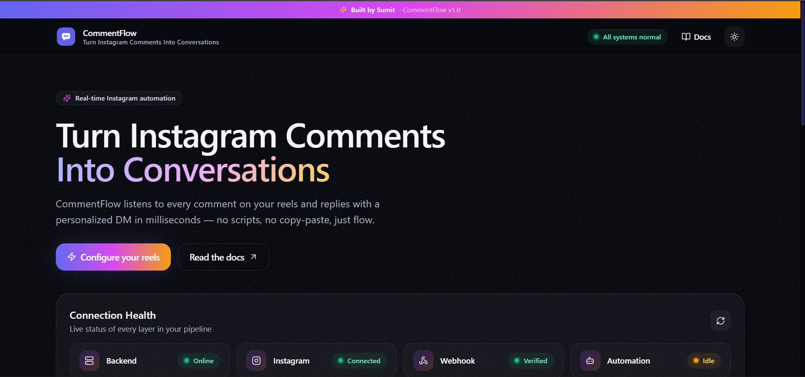
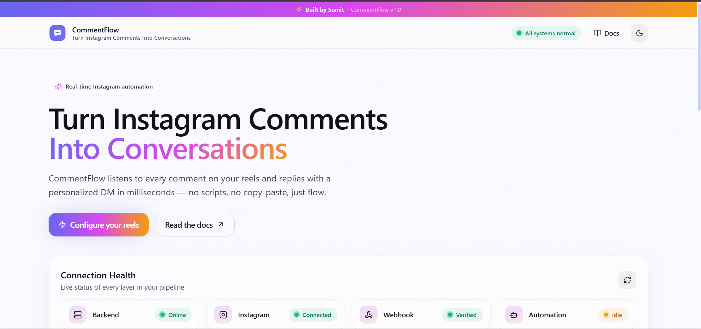
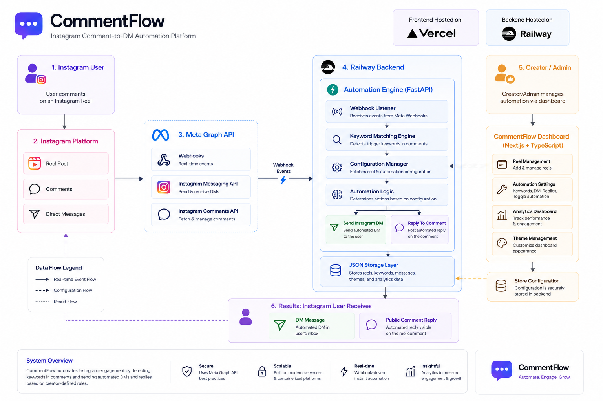

# 🚀 CommentFlow — Instagram Comment-to-DM Automation

Turn Instagram comments into conversations automatically.

CommentFlow is a modern Instagram automation platform that helps creators, businesses, agencies, and marketers instantly engage with users by automatically replying to comments and sending personalized direct messages based on custom trigger keywords.

<p align="center">

<a href="https://instagram-comment-dm-automation.vercel.app">

</a>

<a href="https://delightful-sparkle-production-7092.up.railway.app/health">

</a>


</p>

---

## 🌐 Live Demo

### Frontend Dashboard

https://instagram-comment-dm-automation.vercel.app

### Backend Health

https://delightful-sparkle-production-7092.up.railway.app/health

---

# 🚀 One-Click Deployment

## Deploy Backend on Railway

[](https://railway.app/new)

---

## Deploy Frontend on Vercel

[](https://vercel.com/new/clone?repository-url=https://github.com/sumit-chillal/Instagram-Comment-DM-Automation)

---

# 📸 Dashboard Preview

## Dark Mode Dashboard

<p align="center">

</p>

---

## Light Mode Dashboard

<p align="center">

</p>

---

# 🏗️ System Architecture

<p align="center">

</p>

---

# ✨ Features

## 🤖 Smart Instagram Automation

* Keyword-triggered comment detection
* Automatic Instagram DM delivery
* Automatic public comment replies
* Per-reel automation configuration
* Real-time webhook processing
* Instant engagement workflows

---

## 🎨 Premium Dashboard Experience

* Modern SaaS-style UI
* Dark & Light Mode support
* Framer Motion animations
* Glassmorphism components
* Fully responsive design
* Mobile-friendly dashboard
* One-click reel configuration

---

## 🔒 Production Ready

* Meta Webhook Integration
* Railway Backend Deployment
* Vercel Frontend Deployment
* Environment Variable Management
* FastAPI Backend
* Lightweight JSON Storage
* No database required

---

# ⚙️ How It Works

1. User comments on an Instagram Reel.
2. Meta Webhook sends the event to CommentFlow.
3. FastAPI backend processes the comment.
4. Trigger keyword is validated.
5. Automation engine executes configured actions.
6. User receives:

   * Instagram DM
   * Public comment reply

---

# 🛠️ Tech Stack

| Technology     | Purpose               |
| -------------- | --------------------- |
| FastAPI        | Backend API           |
| Next.js 14     | Frontend Framework    |
| TypeScript     | Type Safety           |
| Tailwind CSS   | Styling               |
| Framer Motion  | Animations            |
| Railway        | Backend Hosting       |
| Vercel         | Frontend Hosting      |
| Meta Graph API | Instagram Integration |

---

# 📋 Prerequisites

Before starting, make sure you have:

* Instagram Professional Account
* Facebook Page connected to Instagram
* Meta Developer App
* Python 3.10+
* Node.js 18+

---

# 🔑 Required Credentials

Backend requires:

```env
VERIFY_TOKEN=
INSTAGRAM_ACCESS_TOKEN=
IG_BUSINESS_ACCOUNT_ID=
```

Example:

```env
VERIFY_TOKEN=my_secure_verify_token
INSTAGRAM_ACCESS_TOKEN=YOUR_ACCESS_TOKEN
IG_BUSINESS_ACCOUNT_ID=YOUR_INSTAGRAM_BUSINESS_ACCOUNT_ID
```

---

# 💻 Local Development

## Backend Setup

```bash
cd backend

pip install -r requirements.txt

cp .env.example .env
```

Update:

```env
VERIFY_TOKEN=
INSTAGRAM_ACCESS_TOKEN=
IG_BUSINESS_ACCOUNT_ID=
```

Start backend:

```bash
uvicorn main:app --reload
```

Backend URL:

```text
http://localhost:8000
```

---

## Frontend Setup

```bash
cd frontend

npm install

cp .env.local.example .env.local
```

Update:

```env
NEXT_PUBLIC_API_URL=http://localhost:8000
```

Start frontend:

```bash
npm run dev
```

Frontend URL:

```text
http://localhost:3000
```

---

# 🚂 Backend Deployment (Railway)

1. Push repository to GitHub.
2. Create a Railway Project.
3. Select the backend directory.
4. Add environment variables.
5. Deploy.
6. Copy Railway URL.

Required Variables:

```env
VERIFY_TOKEN=
INSTAGRAM_ACCESS_TOKEN=
IG_BUSINESS_ACCOUNT_ID=
```

---

# ▲ Frontend Deployment (Vercel)

1. Import GitHub Repository.
2. Set Root Directory:

```text
frontend
```

3. Add Environment Variable:

```env
NEXT_PUBLIC_API_URL=https://your-railway-url.up.railway.app
```

4. Deploy.

---

# 🔗 Configure Meta Webhook

Meta Dashboard → Webhooks → Instagram

Callback URL:

```text
https://your-railway-url.up.railway.app/webhook
```

Verify Token:

```text
YOUR_VERIFY_TOKEN
```

Subscribe to:

```text
comments
```

Save configuration.

---

# 📖 Usage

Configure each reel with:

* Trigger Keyword
* DM Message
* Comment Reply
* Active / Inactive Status

Example:

Keyword:

```text
guide
```

DM Message:

```text
Thanks for your interest! Check your DMs 🚀
```

Comment Reply:

```text
Sent you a DM 🚀
```

---

# 🤝 Contributing

Contributions, feature requests, bug reports, and pull requests are always welcome.

Feel free to fork the repository and improve it.

---

# 📄 License

MIT License

Feel free to use, modify, and distribute.

---

# 👨‍💻 Author

Built and maintained by **Sumit Chillal**

GitHub:

https://github.com/sumit-chillal

LinkedIn:

https://www.linkedin.com/in/sumit-chillal

---

# ⭐ Support

If you found this project useful:

* Star the repository
* Fork the project
* Share it with others
* Contribute improvements

---

<p align="center">
Built with ❤️ by Sumit Chillal
</p>
